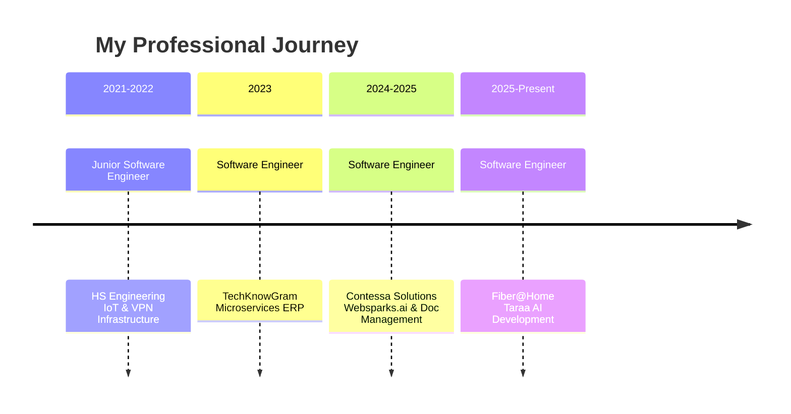

  

  

---

## 🚀 About Me

I'm a **Software Engineer** with 5+ years of experience building **full-stack applications**, **AI-powered systems**, and **enterprise solutions**. Currently working at **Fiber@Home Ltd.** on **Taraa AI** — developing backend systems, AI/LLM integrations, and scalable architecture.

- 🌍 **Location:** Mirpur, Dhaka, Bangladesh
- 💼 **Current Role:** Software Engineer at Fiber@Home Ltd.
- 🎓 **Education:** B.Sc. in Computer Science & Engineering
- 🔥 **Interests:** AI/ML, Distributed Systems, Cloud Infrastructure, Security

---

## 🛠️ Tech Stack

### Languages

### Frameworks

### Cloud & DevOps

### AI & Data

---

## 🏆 Featured Projects

  

### 🤖 Taraa AI ⭐
**AI-Powered Applications Platform** | *Current Project*

### 🧠 Taraa AI Agent & RAG System ⭐
**Advanced AI Agents with RAG & Background Workers** | *Current Project*

  
  
  

Building sophisticated AI agents with Retrieval-Augmented Generation, background workers, and MCP tools integration.

**Key Features:**
- 🤖 Multi-agent architecture with specialized roles
- 📚 RAG implementation for knowledge retrieval and contextual responses
- ⚡ Background workers for async AI task processing
- 🔌 MCP (Model Context Protocol) tools integration
- 🔄 Streaming responses with real-time updates
- 🧠 Context-aware decision making
- 📊 Performance monitoring and optimization

**Tech Stack:** Python, LangChain, Vector DBs, Async Processing, MCP Protocol, Streaming APIs

  
  
  

Building production-grade AI applications with full-stack development and LLM integrations.

**Key Features:**
- 🧠 Multiple AI model integrations (LLMs, embeddings, streaming responses)
- ⚡ Real-time AI-driven features with low latency
- 🔒 Secure authentication with JWT and RBAC
- 📊 Event-driven pipelines for async processing
- 🎯 Mobile app backends for AI-powered applications

**Tech Stack:** Node.js, PostgreSQL, Redis, AI/ML Services

---

### 🌐 Websparks.ai
**AI-Powered Web Development Platform**

  
  
  

Automated web development platform with AI-powered component generation and real-time editing.

**Key Features:**
- 🤖 OpenAI integration for automated component generation
- ✏️ Real-time editing capabilities
- 🎨 Modern frontend with React TypeScript
- ⚡ FastAPI backend for high performance
- 🛡️ Robust security layer with DDoS protection

**Tech Stack:** Python, React, TypeScript, OpenAI, FastAPI

---

### 🔐 Digital Signature Document Management
**Enterprise Document Security System**

  
  
  

Cryptographic document signing and verification workflow for enterprise clients.

**Key Features:**
- 🔏 Digital signatures using OpenSSL certificates
- ✅ Cryptographic document verification
- 🏢 Enterprise-grade security
- 💳 Secure payment gateway integration
- 📊 Ledger-based transaction tracking

**Tech Stack:** Python, OpenSSL, React TypeScript, Vite, PostgreSQL

---

### 🏢 Enterprise ERP with HRD
**Multi-Module Enterprise Resource Planning**

  
  
  

Containerized ERP system with role-based access control and multi-module functionality.

**Key Features:**
- 📦 Microservices architecture
- 🔄 Offline-capable mobile app with sync
- 💰 Payment integrations (Stripe, SSLCommerz)
- 👥 Role-based access control
- 🐳 Docker containerization

**Tech Stack:** Python, FastAPI, React, PostgreSQL, Docker, Spring Boot

**Modules:** Sales, Distribution, Accounting, HR, Inventory

---

### 🚌 Local Transport Management System
**Automated Fare Collection System**

  
  
  

End-to-end automated fare collection for local buses with embedded hardware.

**Key Features:**
- 🔌 Embedded hardware for distance-based fare calculation
- 💳 Automatic fare deduction
- 📊 Admin dashboard for fleet management
- 🗺️ OpenStreetMap integration
- 📱 Real-time tracking

**Tech Stack:** Python, React, FastAPI, MySQL, Embedded Systems

---

### 🎨 Drawing Board Application
**Advanced Canvas & Design Tool**

  
  
  

Full-featured drawing board application built from scratch with advanced graphics capabilities.

**Key Features:**
  - 🎨 Layer support for complex designs
  - ✏️ Image manipulation and editing
  - 🔷 Vector shapes and geometric tools
  - 💾 Save and export functionality
  - 🖼️ Modern, responsive UI

**Tech Stack:** React, TypeScript, Canvas API, Modern Frontend Technologies

---

### 🛒 E-commerce Aggregation Platform
**Multi-Platform Offer Consolidation**

  
  
  

Automated platform that filters and consolidates e-commerce offers from multiple sources.

**Key Features:**
  - 🔍 Automatic offer filtering from multiple platforms
  - 🔄 Real-time consolidation into unified interface
  - 💰 Price comparison and tracking
  - ⚡ Fast search and filtering
  - 📱 Mobile-responsive design

**Tech Stack:** React, FastAPI, Python, PostgreSQL

---

### 🔌 IoT Device Control System
**Remote Hardware Management**

  
  
  

IoT platform enabling remote management and monitoring of connected hardware systems.

**Key Features:**
  - 📡 Real-time device control and monitoring
  - 🔌 Support for multiple IoT protocols
  - 📊 Dashboard for device status
  - ⚠️ Alerts and notifications
  - 🔐 Secure authentication and authorization

**Tech Stack:** Python, IoT Protocols, WebSockets, Real-time Communication

---

### 🌐 VPN Infrastructure
**Secure Network Connectivity**

  
  
  

Secure VPN infrastructure connecting distributed cloud servers for internal communications.

**Key Features:**
  - 🔒 Encrypted tunnel connections
  - 🌐 Site-to-site VPN configuration
  - 🖥️ Multi-server network management
  - 📊 Network monitoring and logging
  - 🛡️ DDoS protection and security hardening

**Tech Stack:** VPN Technologies, Linux Networking, Cloud Infrastructure, Security Protocols

---

### 🚀 CI/CD Pipeline
**Automated Build & Deployment**

  
  
  

Fully automated CI/CD pipeline with commit-triggered workflows and daily reporting.

**Key Features:**
  - ⚙️ Automated build, test, and deployment
  - 🔔 Commit-triggered workflows
  - 📊 Daily automated reporting
  - 🐳 Docker container integration
  - 🔄 Rollback and version management

**Tech Stack:** Jenkins, GitHub Actions, Docker, Shell Scripting, CI/CD Best Practices

---

## 📊 Project Overview

| Category | Projects | Focus Area |
|----------|----------|------------|
| 🤖 **AI/ML** | 3 | LLM Integrations, AI Agents, RAG |
| 🏢 **Enterprise** | 3 | ERP, Document Management, Security |
| 🌐 **Web & Mobile** | 3 | Full-stack Apps, E-commerce |
| 🔌 **IoT & Infrastructure** | 2 | Device Control, VPN, CI/CD |

### By Technology

---

## 📈 Experience Timeline

---

## 🏅 Achievements & Certifications

| Achievement | Year | Description |
|------------|------|-------------|
| 🏆 **ICPC Asia Dhaka Regional** | 2021, 2023 | Onsite Contestant |
| 🥈 **ICPC Asia Dhaka Regional** | 2021, 2022, 2023 | Preliminary Qualifier |
| 🎯 **EUB IUPC Campaign** | 2023 | Participant |
| 💻 **HackerRank Certified** | - | Advanced Java |
| 💻 **HackerRank Certified** | - | Advanced SQL |
| 🎓 **Supervised Learning (AI)** | - | GPAcademy |

---

## 📊 GitHub Stats

  
  

  

---

## 🎯 Current Focus

- 🤖 **AI/LLM Integrations:** Building production AI systems at scale
- ☁️ **Cloud Infrastructure:** Designing scalable, resilient architectures
- 🔒 **Security:** Implementing robust security measures (JWT, RBAC, DDoS)
- 🚀 **Full-Stack Development:** End-to-end application development
- 📊 **Distributed Systems:** Event-driven architectures and microservices

---

## 📫 Get in Touch

  

  

  

  

---

  

  

---

  **Made with ❤️ and ☕ by Nobab Khan**

